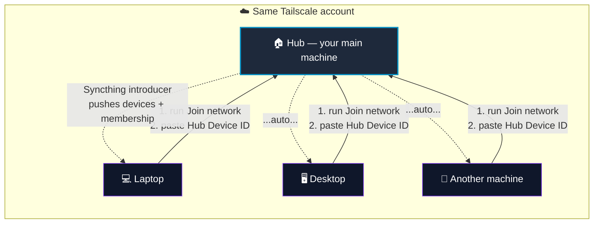

# 🔁 GTK-Syncthing

> **Sync files across your Windows + macOS machines — one click. No cloud, no USB, no manual config.**


---

## ✨ The big idea

Pick **one machine to be the "hub"** (usually your main one). Every other machine
runs **one command** and is automatically connected — devices and sync-folder
membership update themselves. No more copy-pasting Device IDs everywhere.



**Share a folder** (`~/Documents/Sync` by default) across every machine you own —
over your private [Tailscale](https://tailscale.com) network, so nothing touches a
third-party cloud.

---

## 🚀 Quick start (2 minutes)

1. **Install [Tailscale](https://tailscale.com)** and sign in with the **same account** on every machine.
2. **On the hub** (first machine): double-click `GKG-Sync.cmd` (Windows) or `GKG-Sync.command` (macOS) → pick **Install / Add machine**.
3. **On each extra machine**: install Tailscale, then run the same launcher → pick **Join network** and paste the **Hub Device ID**. That's it. ✅

> First time on macOS? Open Terminal and run:
> `chmod +x GKG-Sync.command scripts/mac/*.sh shortcuts/*.command`

### 🗂️ The menu

| # | Action | When to use |
|---|--------|-------------|
| 1 | **Install / Add machine** | Setup a new machine (writes Device IDs) |
| 2 | **Restart sync** | Restart Syncthing if a folder is stuck |
| 3 | **Open Sync folder** | Jump straight into the shared folder |
| 4 | **Guide** | Open the full human guide (`HUONG-DAN.html`) |
| 5 | **Syncthing dashboard** | Web UI for status / advanced control |
| 6 | **Join network** | ⭐ New — connect a machine to the hub (paste Hub Device ID once) |
| 7 | **Sync now** | ⭐ New — trigger a membership/device sync immediately |

---

## 📦 Project layout

```
.
├── GKG-Sync.cmd / .command   ← double-click to open the menu (Win / Mac)
├── START-HERE.html           ← visual guide for end users
├── HUONG-DAN.html            ← full user guide
├── config.example.ini        ← template; script copies it → config.ini
├── config.ini                ← shared config (machine-specific, not committed)
├── scripts/
│   ├── win/                  ← Windows engine (PowerShell)
│   └── mac/                  ← macOS engine (bash)
├── shortcuts/                ← extra launchers (legacy compatibility)
└── legacy/                   ← old SSH/Unison mode (advanced)
```

---

## ❓ FAQ

<details>
<summary><b>Do I need to give each machine every other machine's Device ID?</b></summary>

No. That's the whole point of the hub flow: the hub is the *introducer*, so it
pushes known devices and folder membership to every machine automatically.
You paste the **Hub Device ID only once** per machine.
</details>

<details>
<summary><b>Is my data stored in the cloud?</b></summary>

No. Machines talk directly over your Tailscale private network (WireGuard).
Syncthing only runs locally — nothing is uploaded to a third-party cloud.
</details>

<details>
<summary><b>Can I change the sync folder?</b></summary>

Yes — edit `sync_folder` under `[local]` in `config.ini`, or set it during the
install wizard. Defaults to `~/Documents/Sync`.
</details>

<details>
<summary><b>Why is config.ini not in the repo?</b></summary>

It's machine-specific (your Device IDs / Tailscale IPs). The script auto-creates
it from `config.example.ini` on first run.
</details>

<details>
<summary><b>Packaging a fresh copy for someone?</b></summary>

Run `powershell ./scripts/win/tao-goi-cai.ps1` → produces **`GKG-Syncthing.zip`**
with everything they need (config.ini is deliberately excluded).
</details>

---

## 🔧 Technical notes

- **Sync engine:** [Syncthing](https://syncthing.net/) — trusted, open-source, peer-to-peer.
- **Transport:** [Tailscale](https://tailscale.com/) — machines reach each other anywhere, no port-forwarding.
- **Shared config:** `config.ini` → `[network]` holds the hub / auto-sync settings (`is_hub`, `introducer_device_id`, `auto_share`).
- **Platforms:** Windows (PowerShell) and macOS (bash) share one config file.

---

*Made for people who just want their files to sync.*